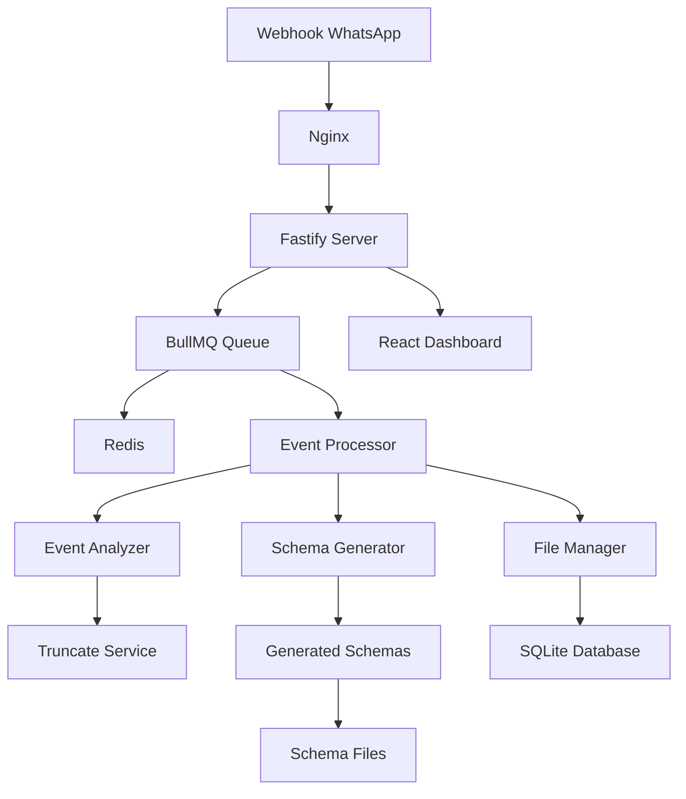

# 📨 WhatsApp Webhook Mapper

[](https://nodejs.org/)
[](https://www.typescriptlang.org/)
[](https://www.docker.com/)
[](LICENSE)

> **Sistema completo de mapeamento automático de eventos de webhook do WhatsApp com geração de schemas Zod e interfaces TypeScript**

O WhatsApp Webhook Mapper é uma solução robusta que recebe eventos de webhook, analisa automaticamente suas estruturas, trunca campos grandes (como base64), e gera schemas Zod e interfaces TypeScript organizados. Inclui dashboard web para monitoramento em tempo real.

## 🌟 Principais Características

### ✨ **Mapeamento Automático**
- 🔍 Análise automática de estruturas JSON
- ✂️ Truncamento inteligente de campos grandes (base64, thumbnails)
- 📊 Geração de schemas Zod e interfaces TypeScript
- 🗂️ Organização automática por tipo de evento

### 🚀 **Performance e Escalabilidade**
- ⚡ Resposta imediata aos webhooks (< 100ms)
- 🔄 Processamento assíncrono com BullMQ + Redis
- 📈 Cluster mode com PM2
- 🎯 Rate limiting inteligente

### 📊 **Dashboard Completo**
- 📱 Interface React responsiva
- 📈 Estatísticas em tempo real
- 🔍 Visualizador de schemas
- 📋 Lista de eventos processados

### 🐳 **Deploy Fácil**
- 🔨 Build Docker multi-stage
- 🎛️ Orquestração com Docker Compose
- 🌐 Nginx reverse proxy incluído
- 📦 Scripts de deploy automatizados

## 🏗️ Arquitetura



## 📁 Estrutura do Projeto

```
webhook-mapper/
├── src/
│   ├── server/              # Backend TypeScript + Fastify
│   │   ├── services/        # Serviços de negócio
│   │   │   ├── TruncateService.ts      # ✂️ Truncamento inteligente
│   │   │   ├── EventAnalyzer.ts        # 🔍 Análise de estruturas
│   │   │   ├── SchemaGenerator.ts      # 📋 Geração Zod/TS
│   │   │   └── SchemaComparator.ts     # 🔄 Comparação/merge
│   │   ├── routes/          # Rotas da API
│   │   ├── queue/           # Processamento assíncrono
│   │   └── config/          # Configurações
│   ├── dashboard/           # Frontend React + Vite
│   │   ├── components/      # Componentes React
│   │   └── api/             # Cliente da API
│   └── types/               # Tipos TypeScript
├── schemas/                 # 📊 Schemas gerados automaticamente
├── docker/                  # 🐳 Configurações Docker
├── scripts/                 # 📝 Scripts de deploy
└── logs/                    # 📋 Logs da aplicação
```

## ⚡ Início Rápido

### Pré-requisitos
- Node.js 20+
- Docker e Docker Compose
- Redis (ou use o container Docker)

### 1️⃣ Instalação Rápida com Docker

```bash
# Clone o repositório
git clone <repository-url>
cd webhook-mapper

# Configure ambiente
cp _env .env
# Edite o arquivo .env conforme necessário

# Deploy completo com um comando
make deploy
```

### 2️⃣ Instalação para Desenvolvimento

```bash
# Instale dependências
npm install

# Configure ambiente
cp _env .env

# Inicie Redis
docker run -d --name redis -p 6379:6379 redis:7-alpine

# Desenvolvimento
npm run dev
```

### 3️⃣ Acesso às Interfaces

Após o deploy, acesse:

- 🌐 **Dashboard**: http://localhost
- 🔗 **API**: http://localhost/api
- 📨 **Webhook**: http://localhost/webhook
- ❤️ **Health Check**: http://localhost/health

## 🔧 Comandos Disponíveis

```bash
# Desenvolvimento
make dev                    # Ambiente de desenvolvimento
make build                  # Build para produção

# Docker
make docker-up              # Inicia todos os serviços
make docker-down            # Para todos os serviços
make docker-logs            # Visualiza logs
make docker-restart         # Reinicia serviço principal

# Deploy
make deploy                 # Deploy completo automatizado
make backup                 # Backup dos dados

# Monitoramento
make status                 # Status dos serviços
make health                 # Check de saúde
make stats                  # Estatísticas da aplicação

# Utilitários
make shell                  # Shell no container
make redis-cli              # CLI do Redis
make generate-test-events   # Gera eventos de teste
```

## 📊 Como Funciona

### 1. **Recepção de Webhooks**
```bash
curl -X POST http://localhost/webhook \
  -H "Content-Type: application/json" \
  -d @evento-whatsapp.json
```

### 2. **Análise Automática**
O sistema analisa a estrutura JSON e identifica:
- Tipo do evento (Message, Picture, Audio, etc.)
- Campos obrigatórios vs opcionais
- Campos que precisam ser truncados

### 3. **Truncamento Inteligente**
Campos grandes são automaticamente truncados:
```json
{
  "image": "iVBORw0KGgoAAAANSUhEUgAA...[TRUNCATED]",
  "thumbnail": "data:image/jpeg;base64,/9j/4AAQ...[TRUNCATED]"
}
```

### 4. **Geração de Schemas**
Para cada tipo de evento, é gerado:
- `schema.zod.ts` - Schema Zod para validação
- `interface.ts` - Interface TypeScript
- `examples.json` - Exemplos truncados
- `metadata.json` - Estatísticas e versionamento
- `raw-samples/` - Amostras completas sem truncamento

### 5. **Exemplo de Schema Gerado**

```typescript
// schemas/Message/schema.zod.ts
import { z } from 'zod';

export const MessageSchema = z.object({
  eventType: z.string(),
  body: z.object({
    data: z.object({
      event: z.object({
        message: z.object({
          text: z.string(),
          timestamp: z.number()
        })
      })
    })
  })
});

export type Message = z.infer<typeof MessageSchema>;
```

## 📈 Estatísticas e Monitoramento

O dashboard fornece:

- 📊 **Total de eventos** processados
- 🎯 **Tipos únicos** de eventos
- ⏱️ **Eventos na última hora/dia**
- 🏃 **Tempo médio** de processamento
- 📋 **Status da queue** (waiting, active, completed, failed)
- 💾 **Uso de disco** (schemas, logs, database)

## 🔧 Configuração Avançada

### Variáveis de Ambiente

```bash
# Server
NODE_ENV=production
PORT=3000
HOST=0.0.0.0
LOG_LEVEL=info

# Database
DATABASE_PATH=./data/database.sqlite

# Redis
REDIS_HOST=localhost
REDIS_PORT=6379

# Truncate Configuration
TRUNCATE_MAX_LENGTH=100
TRUNCATE_FIELDS=base64,JPEGThumbnail,thumbnail,data,image

# Queue Configuration
QUEUE_CONCURRENCY=5
QUEUE_MAX_ATTEMPTS=3
QUEUE_BACKOFF_DELAY=2000
```

### Personalização de Truncamento

```typescript
// src/server/services/TruncateService.ts
const config: TruncateConfig = {
  maxLength: 100,
  fields: ['base64', 'JPEGThumbnail', 'thumbnail', 'data', 'image'],
  preserveStructure: true
};
```

## 🧪 Testes

```bash
# Todos os testes
npm test

# Apenas unitários
npm run test:unit

# Apenas integração
npm run test:integration

# Teste de detecção de eventos whatsmeow
npm run test:events

# Com coverage
npm run test:coverage
```

### 🎯 Tipos de Evento whatsmeow

O sistema reconhece automaticamente **todos os tipos de eventos do whatsmeow** com prioridades otimizadas:

| Prioridade | Tipos de Evento | Descrição |
|------------|-----------------|-----------|
| **15** | `Message`, `FBMessage` | Mensagens de texto e mídia |
| **12** | `UndecryptableMessage` | Mensagens que falharam na descriptografia |
| **11** | `Picture` | Fotos de perfil e mídia |
| **10** | `MediaRetry` | Retry de mídia |
| **8-9** | `Audio`, `Video`, `Document` | Conteúdo de mídia |
| **7** | `JoinedGroup`, `GroupInfo`, `NewsletterLiveUpdate` | Eventos de grupo |
| **6** | `UserAbout`, `Newsletter*` | Perfis e newsletters |
| **5** | `Receipt`, `ChatPresence`, `IdentityChange` | Confirmações e mudanças |
| **4** | `Connected`, `PairSuccess`, `Presence` | Estados de conexão |
| **3** | `HistorySync`, `OfflineSyncCompleted`, `Blocklist` | Sincronização |
| **2** | `KeepAliveTimeout`, `PrivacySettings` | Monitoramento |
| **1** | `QR`, `StreamError`, `Disconnected` | Estados básicos |

**Eventos de Erro (Alta Prioridade):**
`PairError`, `LoggedOut`, `TemporaryBan`, `ClientOutdated`, `ConnectFailure`

Use `npm run test:events` para validar a detecção de todos os tipos.

### Metas de Qualidade
- ✅ **80%** de cobertura mínima
- ✅ **100%** para serviços críticos
- ✅ TypeScript strict mode
- ✅ Linting automático

## 🐳 Produção com Docker

### Estrutura de Containers

```bash
docker-compose ps
```

| Serviço | Porta | Descrição |
|---------|-------|-----------|
| webhook-mapper | 3000 | Aplicação principal |
| webhook-redis | 6379 | Queue e cache |
| webhook-nginx | 80,443 | Reverse proxy |

### Backup e Recuperação

```bash
# Backup automático
make backup

# Backup manual
docker-compose exec webhook-mapper npm run backup

# Restaurar backup
tar -xzf backup-20240101_120000.tar.gz
docker-compose down
cp -r backup-data/* ./data/
docker-compose up -d
```

## 📊 Performance

### Benchmarks
- **Resposta webhook**: < 100ms
- **Processamento**: < 30s por evento
- **Payload máximo**: 100MB
- **Throughput**: 1000+ eventos/min

### Otimizações Incluídas
- ⚡ Cluster mode com PM2
- 🔄 Queue assíncrona
- 📦 Gzip compression
- 🚀 Rate limiting
- 💾 Cache de estruturas

## 🤝 Contribuição

1. Fork o projeto
2. Crie uma branch: `git checkout -b feature/nova-funcionalidade`
3. Commit: `git commit -m 'Add: nova funcionalidade'`
4. Push: `git push origin feature/nova-funcionalidade`
5. Abra um Pull Request

## 📝 Changelog

### v1.0.0
- ✨ Sistema completo de mapeamento de webhooks
- ✂️ Truncamento inteligente de campos grandes
- 📊 Geração automática de schemas Zod/TypeScript
- 🎛️ Dashboard React responsivo
- 🐳 Deploy Docker completo
- 📈 Monitoramento e estatísticas
- 🧪 Suite de testes completa

## 📄 Licença

Este projeto está sob a licença MIT. Veja o arquivo [LICENSE](LICENSE) para detalhes.

## 🆘 Suporte

- 📖 **Documentação**: Ver arquivos em `/docs`
- 🐛 **Issues**: [GitHub Issues](issues)
- 💬 **Discussões**: [GitHub Discussions](discussions)

---

<div align="center">

**[⭐ Star este projeto](stargazers) • [🐛 Reportar Bug](issues) • [✨ Solicitar Feature](issues)**

Feito com ❤️ para a comunidade WhatsApp

</div>
