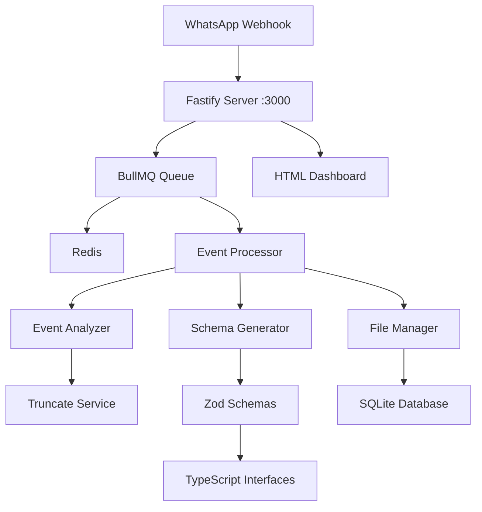

# 🚀 WhatsApp Webhook Mapper

[](https://nodejs.org/)
[](https://www.typescriptlang.org/)
[](https://www.fastify.io/)
[](https://www.docker.com/)
[](LICENSE)

> **Sistema automatizado de mapeamento de eventos de webhook WhatsApp com geração de schemas Zod e interfaces TypeScript**

Sistema completo que recebe webhooks, analisa estruturas JSON automaticamente, trunca campos grandes (base64, thumbnails), gera schemas Zod/TypeScript organizados e oferece dashboard web para monitoramento.

## ✨ Características Principais

### 🎯 **Funcionalidades Core**
- 📥 **Receptor de Webhooks** - Recebe eventos WhatsApp via HTTP POST
- 🔍 **Análise Automática** - Detecta estruturas JSON e tipos de eventos  
- ✂️ **Truncamento Inteligente** - Remove dados grandes (base64, thumbnails)
- 📊 **Geração de Schemas** - Cria schemas Zod e interfaces TypeScript
- 🗂️ **Organização Automática** - Estrutura arquivos por tipo de evento

### ⚡ **Performance & Escalabilidade**
- 🚀 **Resposta Imediata** - Webhooks respondidos em < 100ms
- 🔄 **Processamento Assíncrono** - Queue com BullMQ + Redis
- 🏃 **Alta Performance** - Fastify + PM2 cluster mode
- 📈 **Rate Limiting** - Proteção contra spam
- 💾 **Persistência** - SQLite para metadados

### 🎨 **Dashboard Web**
- 🌐 **Interface HTML5** - Dashboard responsivo e rápido
- 📊 **Estatísticas em Tempo Real** - Status da API e schemas
- 📋 **Visualização de Dados** - Eventos processados e estruturas
- 🔄 **Atualização Automática** - Dados refreshed a cada 30s

## 🏗️ Arquitetura



## 📁 Estrutura do Projeto

```
webhook-mapper/
├── src/
│   ├── server/                 # 🔧 Backend TypeScript + Fastify
│   │   ├── services/           # 🛠️ Serviços de negócio
│   │   │   ├── TruncateService.ts      # ✂️ Truncamento inteligente
│   │   │   ├── EventAnalyzer.ts        # 🔍 Análise de estruturas
│   │   │   ├── SchemaGenerator.ts      # 📋 Geração Zod/TS
│   │   │   ├── SchemaComparator.ts     # 🔄 Comparação/merge
│   │   │   └── FileManager.ts          # 🗂️ Gestão de arquivos
│   │   ├── routes/             # 🛣️ Rotas da API
│   │   │   ├── webhook.ts              # 📥 Endpoint webhooks
│   │   │   └── api.ts                  # 📊 API REST
│   │   ├── queue/              # ⚡ Processamento assíncrono
│   │   ├── config/             # ⚙️ Configurações
│   │   └── utils/              # 🔧 Utilitários
│   └── types/                  # 📝 Tipos TypeScript compartilhados
├── public/                     # 🌐 Frontend HTML + CSS + JS
│   └── index.html              # 🎨 Dashboard web responsivo
├── schemas/                    # 📊 Schemas gerados automaticamente
│   ├── Message/                # 📱 Schemas de mensagens
│   ├── Picture/                # 🖼️ Schemas de imagens  
│   └── .../                    # 📦 Outros tipos de evento
├── data/                       # 💾 Banco de dados SQLite
├── logs/                       # 📋 Logs da aplicação
├── docker-compose.yml          # 🐳 Orquestração Docker
├── Dockerfile                  # 📦 Build otimizado multi-stage
└── ecosystem.config.js         # ⚡ Configuração PM2
```

## 🚀 Início Rápido

### Pré-requisitos
- **Node.js 20+**
- **Docker & Docker Compose** (recomendado)
- **Redis** (ou usar container)

### 🐳 Deploy com Docker (Recomendado)

```bash
# Clone o repositório
git clone <repository-url>
cd webhook-mapper

# Configure ambiente
cp .env.example .env
# Edite .env se necessário

# Deploy completo
docker-compose up -d

# Verifique status
docker-compose ps
```

### 💻 Desenvolvimento Local

```bash
# Instale dependências
npm install

# Configure ambiente
cp .env.example .env

# Inicie Redis (em outro terminal)
docker run -d --name redis -p 6379:6379 redis:7-alpine

# Desenvolvimento com hot reload
npm run dev
```

### 🌐 Acessos

Após inicialização:

| Serviço | URL | Descrição |
|---------|-----|-----------|
| 🎨 **Dashboard** | http://localhost:3000 | Interface web principal |
| 📊 **API Health** | http://localhost:3000/api/health | Status detalhado dos serviços |
| 📋 **Schemas** | http://localhost:3000/api/schemas | Lista de schemas gerados |
| 📥 **Webhook** | http://localhost:3000/webhook | Endpoint para receber eventos |
| ❤️ **Health Check** | http://localhost:3000/health | Status básico da aplicação |

## 📊 Como Funciona

### 1. 📥 **Recepção de Webhooks**

```bash
# Envie um evento WhatsApp
curl -X POST http://localhost:3000/webhook \
  -H "Content-Type: application/json" \
  -d '{
    "eventType": "Message",
    "body": {
      "message": {
        "text": "Hello World",
        "timestamp": 1642099200
      }
    }
  }'
```

### 2. 🔍 **Análise Automática**

O sistema detecta automaticamente:
- **Tipo do evento** (Message, Picture, Audio, etc.)
- **Campos obrigatórios** vs opcionais
- **Campos para truncar** (base64, thumbnails)
- **Estrutura aninhada** completa

### 3. ✂️ **Truncamento Inteligente**

Campos configurados são automaticamente truncados:

```json
// Antes
{
  "image": "iVBORw0KGgoAAAANSUhEUgAAAB4AAAAeCAYAAAA7...[10KB mais]",
  "thumbnail": "data:image/jpeg;base64,/9j/4AAQSkZJRg...[5KB mais]"
}

// Depois
{
  "image": "iVBORw0KGgoAAAANSUhEUgAAAB4AAAAe...[TRUNCATED]",
  "thumbnail": "data:image/jpeg;base64,/9j/4AAQ...[TRUNCATED]"
}
```

### 4. 📊 **Geração de Schemas**

Para cada tipo de evento, são gerados automaticamente:

```
schemas/Message/
├── schema.zod.ts       # 📋 Schema Zod para validação
├── interface.ts        # 🔧 Interface TypeScript  
├── examples.json       # 📝 Exemplos truncados
├── metadata.json       # 📊 Estatísticas e versionamento
└── raw-samples/        # 📦 Amostras completas (até 10)
    ├── sample-001.json
    └── sample-002.json
```

### 5. 🧩 **Schema Zod Gerado**

```typescript
// schemas/Message/schema.zod.ts
import { z } from 'zod';

export const MessageSchema = z.object({
  eventType: z.string(),
  body: z.object({
    message: z.object({
      text: z.string(),
      timestamp: z.number(),
      from: z.string().optional(),
      image: z.string().describe('TRUNCATED FIELD - Original type: base64').optional()
    })
  })
});

export type Message = z.infer<typeof MessageSchema>;
```

## 📈 Dashboard e Monitoramento

O dashboard oferece visualização em tempo real de:

- 📊 **Status da API** - Conectividade e uptime
- 🎯 **Schemas Gerados** - Total e tipos únicos
- ⏱️ **Estatísticas** - Eventos processados e performance
- 🔄 **Atualização Automática** - Dados refreshed automaticamente

### Exemplos de Uso da API

```bash
# Status geral da aplicação
curl http://localhost:3000/health

# Status detalhado dos serviços
curl http://localhost:3000/api/health

# Lista todos os schemas gerados
curl http://localhost:3000/api/schemas

# Estatísticas de webhooks
curl http://localhost:3000/webhook/stats
```

## ⚙️ Configuração

### Variáveis de Ambiente

```bash
# Server
NODE_ENV=production
PORT=3000
HOST=0.0.0.0
LOG_LEVEL=info

# Database
DATABASE_PATH=./data/database.sqlite

# Redis
REDIS_HOST=localhost
REDIS_PORT=6379

# Security
CORS_ORIGIN=*
RATE_LIMIT_MAX=1000
RATE_LIMIT_WINDOW=60000

# Truncate Configuration
TRUNCATE_MAX_LENGTH=100
TRUNCATE_FIELDS=base64,JPEGThumbnail,thumbnail,data,image

# File Management
MAX_RAW_SAMPLES=10
MAX_EXAMPLES_PER_SCHEMA=20

# Queue Configuration
QUEUE_CONCURRENCY=5
QUEUE_MAX_ATTEMPTS=3
QUEUE_BACKOFF_DELAY=2000
```

### Personalização do Truncamento

Edite `src/server/services/TruncateService.ts`:

```typescript
const config: TruncateConfig = {
  maxLength: 100,
  fields: [
    'base64', 
    'JPEGThumbnail', 
    'thumbnail', 
    'data', 
    'image',
    'audio',      // Adicione seus campos personalizados
    'document'
  ],
  preserveStructure: true
};
```

## 🛠️ Comandos Disponíveis

```bash
# Desenvolvimento
npm run dev                    # Servidor com hot reload
npm run build                  # Build TypeScript para produção  
npm start                      # Executa build de produção

# Docker
docker-compose up -d           # Inicia todos os serviços
docker-compose down            # Para todos os serviços
docker-compose logs -f         # Visualiza logs em tempo real
docker-compose restart webhook-mapper  # Reinicia aplicação

# Utilitários
npm run clean                  # Limpa diretório dist/
npm run type-check             # Verifica tipos TypeScript
npm test                       # Executa testes (se configurados)
```

## 🐳 Produção com Docker

### Serviços Incluídos

| Serviço | Container | Porta | Descrição |
|---------|-----------|-------|-----------|
| **App Principal** | webhook-mapper | 3000 | Aplicação Node.js + Dashboard |
| **Cache/Queue** | webhook-redis | 6379 | Redis para BullMQ |

### Dados Persistidos

- `./schemas/` → Schemas Zod e TypeScript gerados
- `./data/` → Banco SQLite com metadados
- `redis-data` → Cache Redis (volume Docker)

### Health Checks

Todos os serviços incluem health checks automáticos:

```bash
# Verifica status dos containers
docker-compose ps

# Logs de um serviço específico  
docker-compose logs webhook-mapper

# Health check manual
curl http://localhost:3000/health
```

## 📊 Performance

### Benchmarks Típicos
- ⚡ **Resposta webhook**: < 100ms
- 🔄 **Processamento completo**: < 30s por evento
- 📦 **Payload máximo**: 100MB
- 🚀 **Throughput**: 1000+ eventos/min

### Otimizações Incluídas
- 🏃 **Cluster PM2** - Múltiplas instâncias
- 📦 **Compression Gzip** - Menor tráfego de rede
- ⚡ **Queue Assíncrona** - Não bloqueia webhooks
- 💾 **Cache de Estruturas** - Evita re-processamento
- 🎯 **Rate Limiting** - Proteção contra abuse

## 🧪 Tipos de Evento Suportados

O sistema detecta automaticamente **todos os tipos de evento do WhatsApp/whatsmeow**:

| Prioridade | Tipos | Exemplos |
|------------|-------|----------|
| **Alta** | `Message`, `FBMessage` | Mensagens de texto/mídia |
| **Alta** | `UndecryptableMessage` | Mensagens criptografadas |
| **Média** | `Picture`, `Audio`, `Video` | Conteúdo multimídia |
| **Baixa** | `Receipt`, `Presence`, `Typing` | Status e confirmações |

✨ **Auto-detecção**: Novos tipos são automaticamente reconhecidos e processados!

## 🔧 Desenvolvimento

### Estrutura de Desenvolvimento

1. **Hot Reload** - Código recarregado automaticamente
2. **TypeScript Strict** - Máxima segurança de tipos
3. **ESLint + Prettier** - Código padronizado
4. **Health Checks** - Monitoramento contínuo

### Adicionando Novos Recursos

```typescript
// 1. Adicione service em src/server/services/
export class NovoService {
  constructor(private logger: Logger) {}
  
  async processar(dados: any): Promise<void> {
    // Sua lógica aqui
  }
}

// 2. Registre em src/server/routes/
app.post('/nova-rota', async (request, reply) => {
  const resultado = await novoService.processar(request.body);
  return { success: true, data: resultado };
});
```

## 🤝 Contribuição

1. **Fork** o projeto
2. **Branch**: `git checkout -b feature/nova-funcionalidade`  
3. **Commit**: `git commit -m 'feat: adiciona nova funcionalidade'`
4. **Push**: `git push origin feature/nova-funcionalidade`
5. **Pull Request** detalhado

## 📄 Licença

Este projeto está licenciado sob a **MIT License** - veja [LICENSE](LICENSE) para detalhes.

## 🆘 Suporte

- 🐛 **Issues**: [GitHub Issues](../../issues)
- 💬 **Discussões**: [GitHub Discussions](../../discussions)  
- 📧 **Email**: [seu-email@exemplo.com](mailto:seu-email@exemplo.com)

---

<div align="center">

**[⭐ Star este projeto](../../stargazers) • [🐛 Reportar Bug](../../issues/new) • [✨ Solicitar Feature](../../issues/new)**

Feito com ❤️ para automação de webhooks WhatsApp

</div>